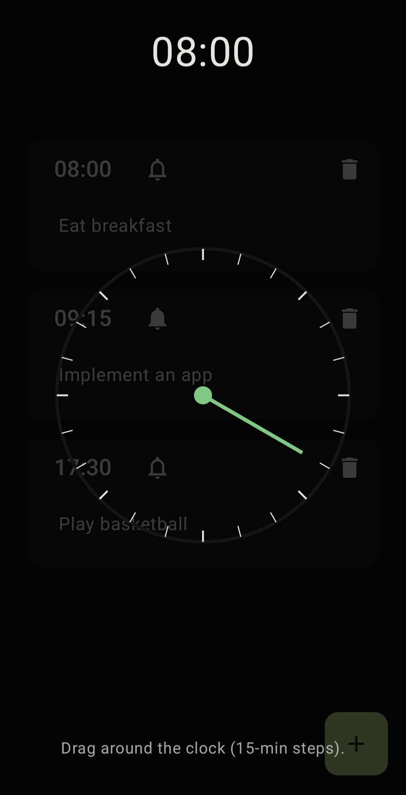
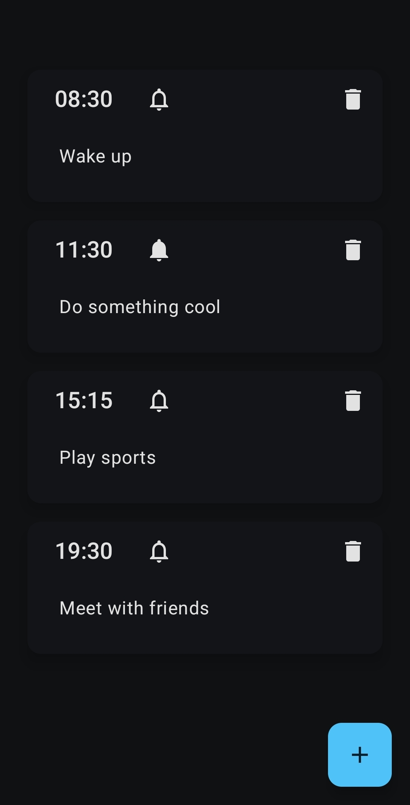
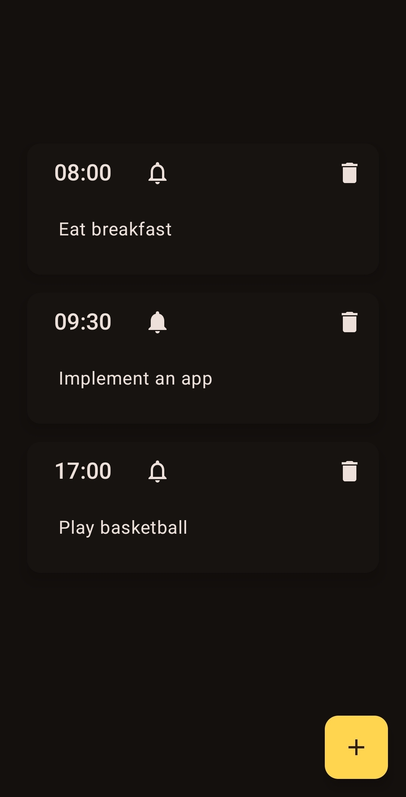

# 🤟 DayPlan

DayPlan is a simple Android app built with **Kotlin** and **Jetpack Compose** that helps you plan out your day in a clean and intuitive way.  
With a minimalist interface and calm colors, the app makes scheduling tasks feel effortless.

---

## ✨ Features
- 🗓️ Add and manage daily tasks 
- 🔔 Enable notifications for specific tasks
- ⏱️ Pick the time in fast and innovative way
- 🎨 Choose your favorite app theme

---

## 🛠️ Tech Stack
- [Kotlin](https://kotlinlang.org/) – modern programming language for Android  
- [Jetpack Compose](https://developer.android.com/jetpack/compose) – declarative UI toolkit  
- [AlarmManager](https://developer.android.com/reference/android/app/AlarmManager) – schedule exact alarms  
- [Material 3](https://m3.material.io/) – design system and components  

---

## 📸 Screenshots

  
  
  
  

